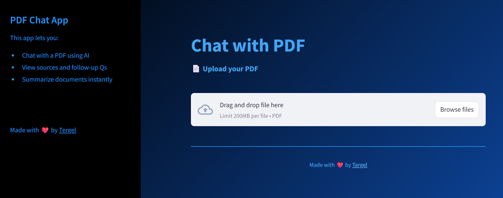
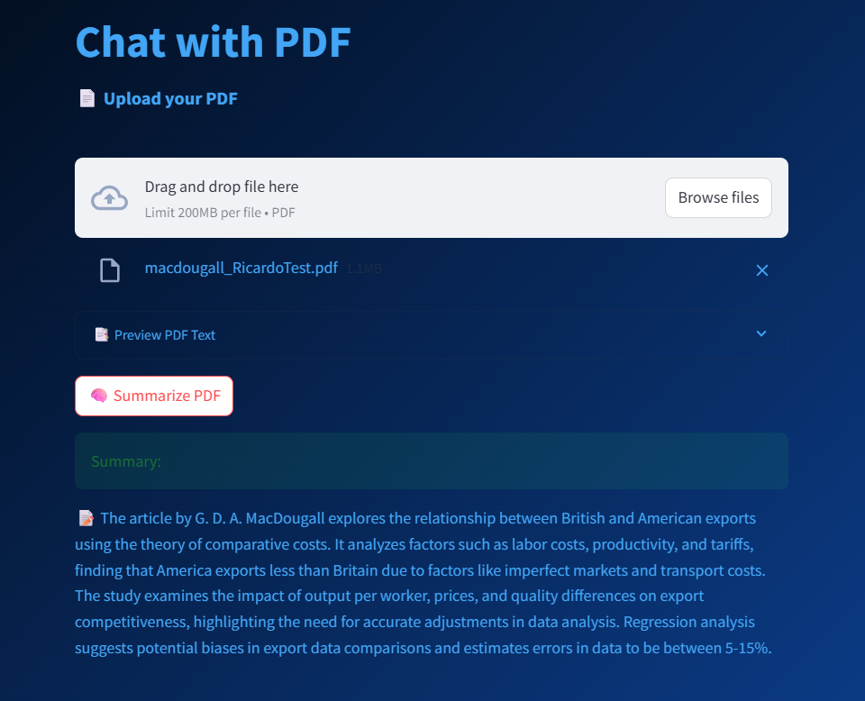
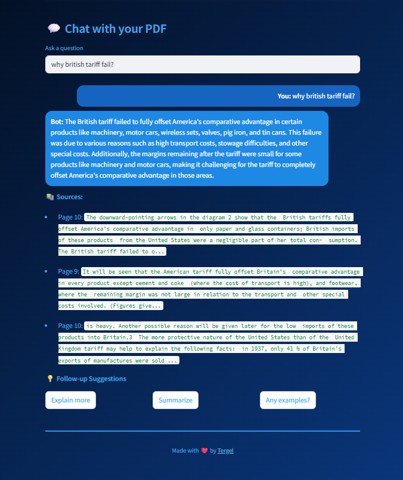
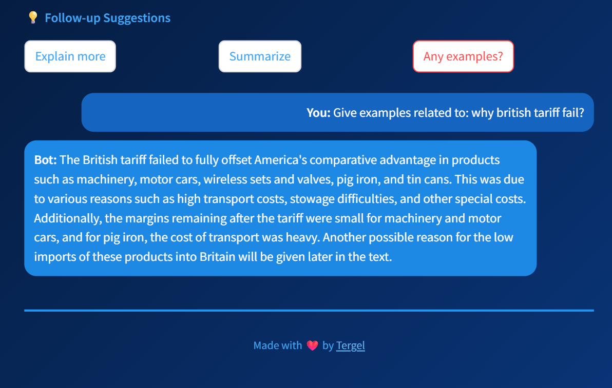

# PDF Chat App

This project is a PDF chatbot application built using Streamlit and Langchain. It allows users to upload PDF documents, extract text, summarize content, and interact with the document through a conversational interface.

## Features

- **Upload PDF files and extract text:** Easily upload any PDF and preview its extracted content.
- **Summarize the content:** Instantly generate a concise summary of your PDF with one click.
- **Chat with the PDF using AI:** Ask questions about your document and get intelligent answers.
- **View sources and follow-up questions:** See which part of the PDF the answer comes from and get suggested follow-up queries.

## Screenshots

### Main View
Shows the main interface for uploading and interacting with your PDF.


### Summary Outcome
Displays the summary generated from your PDF.


### AI Answer
Example of an AI-generated answer to a user question about the PDF.


### Follow-up Suggestions
Shows possible follow-up questions you can ask about your document.


## Installation

To run this application, you need to install the required dependencies. You can do this by running:

```
pip install -r requirements.txt
```

## Setup OpenAI API Key

Create a file named `.env` in the project directory and add your OpenAI API key:

```
OPENAI_API_KEY=your_openai_api_key_here
```

## Usage

1. Run the application using the command:
   ```
   streamlit run app.py
   ```
2. Open the provided URL in your web browser.
3. Upload a PDF file and start interacting with it!

## Contributing

Feel free to submit issues or pull requests if you have suggestions or improvements for the project.